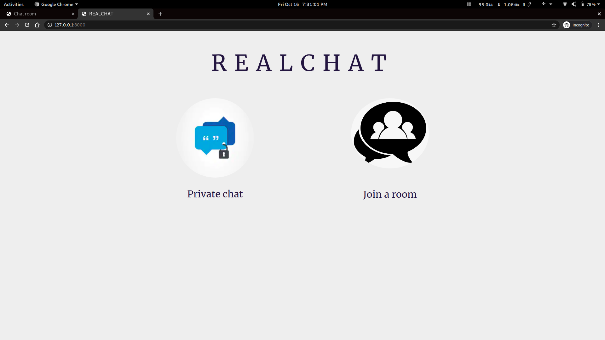
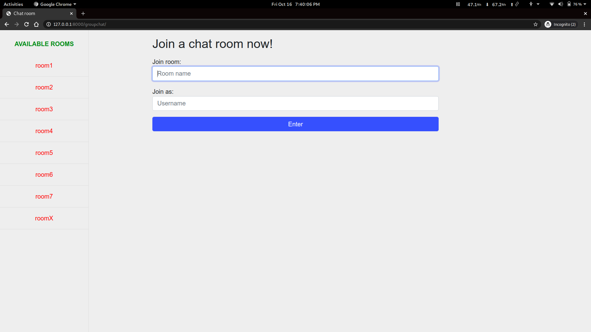
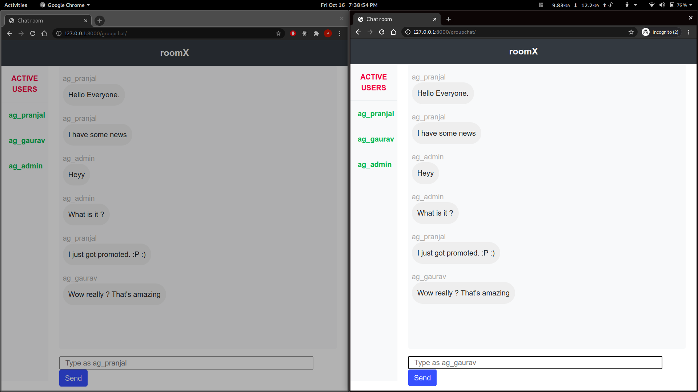
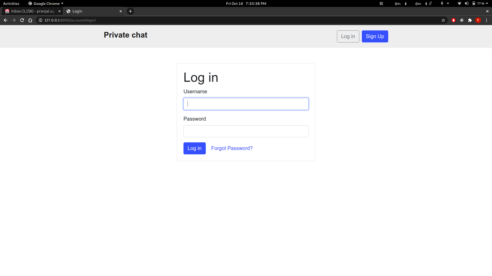
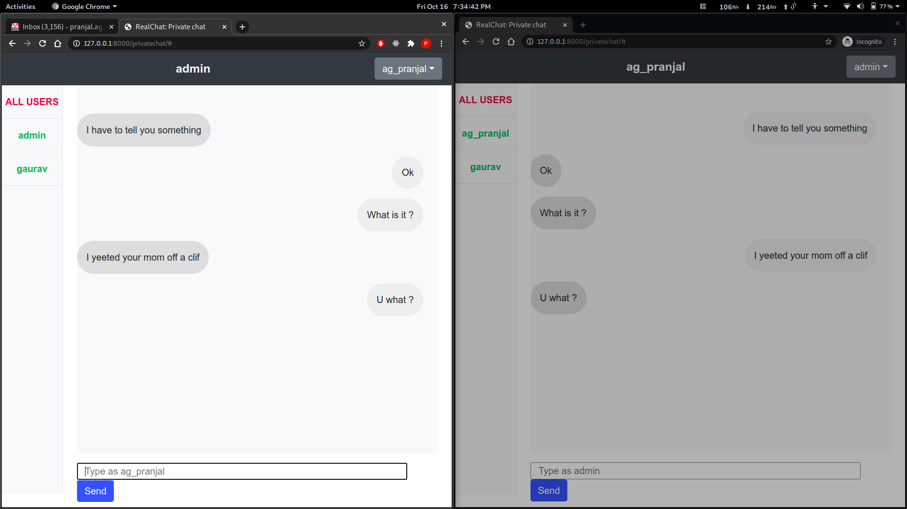

# RealChat
Real time chat application

+ Private chat (peer to peer) (with proper authentication and message storage)
+ Group chat

## Create a virtual environment and activate it

Run the following command in your terminal:
### `sudo apt install virtualenv`

In project directory:
+ ### `virtualenv env`
+ ### `source env/bin/activate`

> Note: To deactivate the virtual environment after you are done, type `deactivate` in the terminal.

## Install dependencies
In project directory:
### `pip3 install -r requirements.txt`

## Create the database
In project directory:

+ ### `python3 manage makemigrations`
+ ### `python3 manage migrate`

## Start the server
In project directory
### `python3 manage.py runserver`

Open browser and go to [127.0.0.1:8000](http://127.0.0.1:8000)

---
### Screenshots

